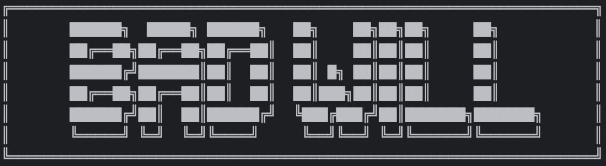

# BADWILL INTRO

BADWILL is an unsecured loan platform for new users, if you have the [ FORGOTTEN BADGE ] NFT. You can loan $500 BUGS.

BADWILL may or may not "liquidate" STUMP and we do have another SBT [ MALFUNCTION_RECORD ], it will be minted to MALFUNCTION STUMP. STUMPs with that record can't access BADWILL in the future.

#  MOTIVATION

TCM was sybil attacked so bad that TCM guys had to remove the graduate function and then also the 500 $BUGS sent to new players after tutorial. That's such a big bottleneck for onboarding new players. That's why we built BADWILL. It's a game of trust and I bid 500 bugs for that

# Contracts

LOAN CONTRACT
0xbc96085f358BDd5E7fc96E3c72cba84f96031860

SBT-A symbol [BADGE] NAME [ FORGOTTEN BADGE ]
0x3036c0ecb8a32bD8775C06B848a8f184cD080376

SBT-B symbol [MLFNCT] NAME [ MALFUNCTION RECORD ]
0xBF18Cf3A9dC9bBB8eF75Ed40487CB7272118a8fa

# AW RESEARCH NOTICE

[AW RESEARCH EMERGENCY NOTICE]

Researchers at AW RESEARCH have successfully decrypted and replicated the [ FORGOTTEN BADGE ] 
@movingcastles_ during the Redstone Hackathon. To celebrate this technological breakthrough and to test the functionality of the new badges, we have injected "10,000 $BUGS" into "BADWILL INDUSTRIES INTERNATIONAL."

https://bad-will.vercel.app

# BADWILL



[NOTICE TO ALL STUMPS: PROCEED WITH CAUTION]

[SECURITY  CHECK]

[LOG IN]

SCANNING FOR BADGE … [YES]
SCANNING FOR UNAUTHORIZED DEVICES … [ERROR]

[ACCESS  GRANTED]

WELCOME TO [BADWILL] , STUMP [WALLET ADDRESS]

[GUIDANCE]

BADWILL ENCOURAGES ALL OPERATIVES TO DEAL CAUTIOUSLY. 
UPON PRESENTING THE [BADGE] AT OUR COUNTER, THE BEARER WAS GRANTED AN EMERGENCY LOAN OF 500 $BUGS UNDER THE AUSPICES OF BADWILL. 
THIS TRANSACTION, THOUGH SEEMINGLY BENIGN, COMES WITH A STRINGENT CONDITION AS DICTATED BY THE CRYPTIC LAWS GOVERNING OUR OPERATIONS.
MISUSE OR NEGLIGENCE CAN LEAD TO ALTERATIONS IN YOUR EXISTENTIAL LEDGER THAT ARE NOT EASILY RECTIFIED.
EVERY TRANSACTION IS A PACT, AND EVERY PACT IS A RISK.
TREAD LIGHTLY, BARGAIN WISELY.

「LOAN 500 BUGS」，「PAY 525 BUGS」

[WARNING]

THE LOAN MUST BE REPAID BY THE END OF YOUR SHIFT. 
FAILURE TO COMPLY WILL RESULT IN UNDISCLOSED CONSEQUENCES TO YOUR RECORDS. 
[MALFUNCTION RECORD] MAY MANIFEST AS BENIGN OR AS CATASTROPHICALLY IRREVERSIBLE. 
THE CHOICE IS YOURS.

BADWILL INDUSTRIES INTERNATIONAL, 770 ECHO CHAMBER, AW 69420


## Prerequisites

To make sure it works, you should point the valid contract address in the `frontend/src/App.tsx` `contract/loan.sol` file first.
```typescript
    const loanContract = "0x";
    // const sbtA = "0x";
    // const sbtB = "0x";
    const bugs = "0x";
```
```solidity
    IERC20 public bugToken = IERC20(0xadd); // bugsToken
```

## Available Scripts

In the project directory, you can run:

### `npm install --force`

Installs the latest version of all packages.

### `npm start`

Runs the app in the development mode.\
Open [http://localhost:3000](http://localhost:3000) to view it in the browser.

The page will reload if you make edits.\
You will also see any lint errors in the console.

### `npm run build`

Builds the app for production to the `build` folder.\
It correctly bundles React in production mode and optimizes the build for the best performance.

The build is minified and the filenames include the hashes.\
Your app is ready to be deployed!
